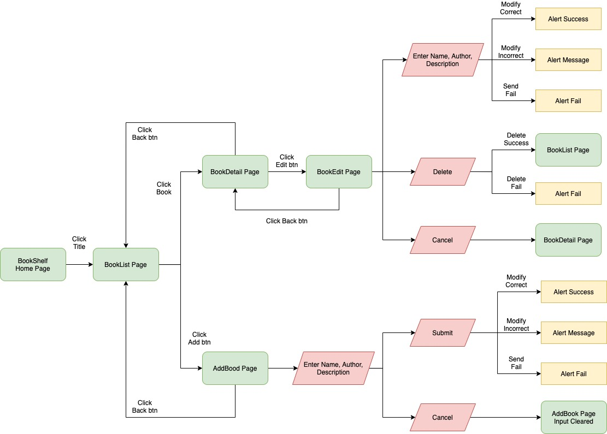

# bookshelf

## Demo
Link: https://fiona20072007.github.io/bookshelf/

由於只使用 Github Pages，並沒有使用 firebase 或其他的網站部署，因此頁面無法支援重新整理。

原因：GitHub Pages 是完全靜態的 Server，網址對應到了真實的檔案路徑，當存取根目錄 / 時，預設的設定會去找 /index.html，當在 /[repo-name]/books 頁面重新整理時，dist資料夾內並沒有 /[repo-name]/books/index.html，所以會顯示 404 not found。

如要 clone 在本地測試，請使用 master branch 測試

步驟：

1. `git clone https://github.com/fiona20072007/bookshelf.git`
2. cd 到該資料夾並 `npm install`
3. `npm run start`
4. 到 http://localhost:3000/bookshelf

## User Flow

＊＊（由於不輸入備註送出後API response會顯示有欄位未填寫，因此備註也列為必填項目）

到首頁後，點擊標題進入到 BookList 頁，可點擊標題欄位的新增書本按鈕或點擊書本。

點擊新增按鈕後進入新增頁，可以輸入名稱、作者、備註。如有欄位未填寫點擊新增按鈕後會顯示提示，如都有填寫後送出成功和失敗也會顯示提示。點擊取消會清空所有輸入框。

點擊書本後進入 BookDetail 頁，點擊編輯進到修改頁，修改時如有欄位未填寫點擊修改按鈕後會顯示提示，如都有填寫後送出成功和失敗也會顯示提示。點擊取消會清空所有輸入框並返回到 BookDetail 頁。刪除時如果刪除成功會導到 BookList 頁，刪除失敗會顯示提示。

除了 BookList 頁以外的其他頁面左上方都有返回按鍵，功能都是返回上一頁。

整個專案沒有使用第三方 library，主要使用 React 搭配 scss。

### 遇到的困難、問題，以及解決的方法

1. 遇到類似的頁面會想拆成共用 component，但考量到新增書本頁與修改書本頁如果拆成共用後會難以擴充各自的功能，並且兩個頁面主要作用也不同，因此只把input拆出來。
2. 原本考慮把書本詳細頁和編輯頁面拆成兩個不同的component，但由於各自功能太相似，差別只是能不能修改，拆成兩個component就要多一些維護成本，因此考量後決定在書本詳細頁面判斷是否為編輯狀態。